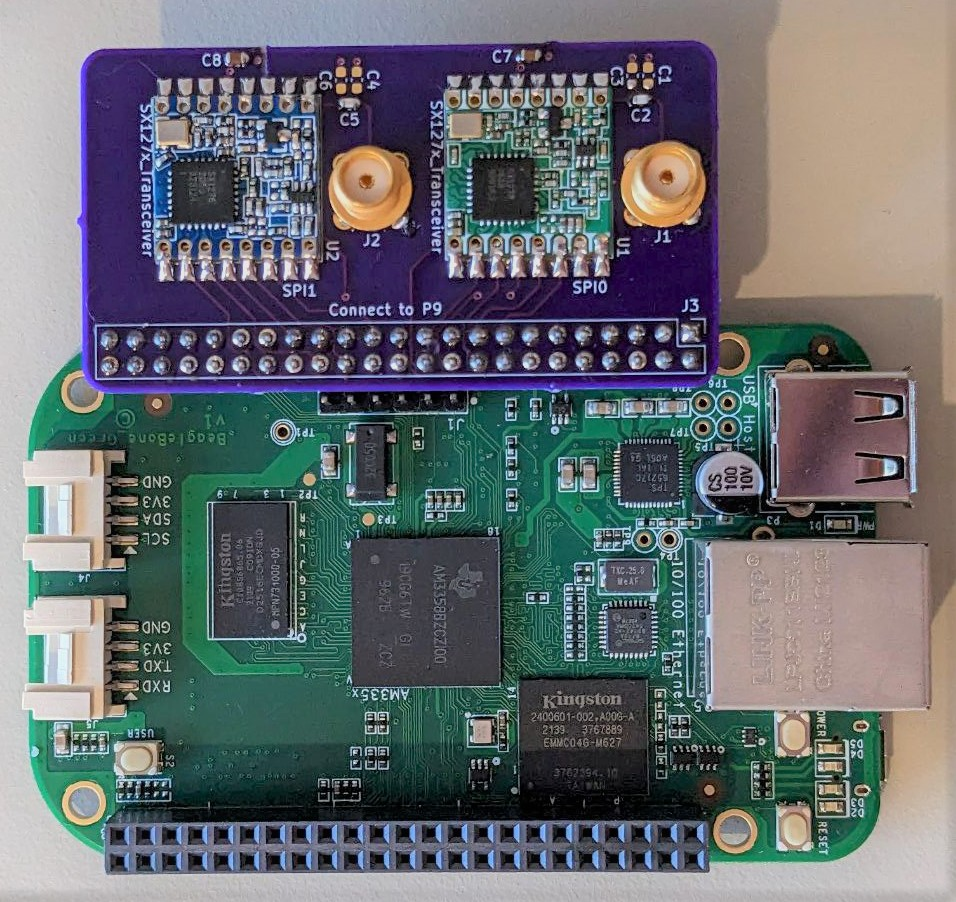

# Dual LoRa module adapter for BeagleBone

This PCBA connects widely available LoRa modules based on Semtech [SX127x][] RFIC, such as [this module][module] ([archive][module-archive]) sold on Aliexpress for less than $3, to the Texas Instruments [BeagleBone][] family of single board computers.

[module]: https://www.aliexpress.com/item/32814250318.html
[module-archive]: https://archive.today/oJ4Fh
[s127x]: https://www.semtech.com/products/wireless-rf/lora-connect
[beaglebone]: https://beaglebone.org



## Requirements

The module must have a size of 16 by 16 mm, and have 16 castellated pads with 2 mm spacing; for details, see the Kicad footprint. The module pinout must match the following, viewed from the top:

| Pin 1? | &nbsp; |
| ------ | ------ |
| ANT    |    GND |
| GND    |   DIO5 |
| DIO3   | nRESET |
| DIO4   |    nCS |
| 3V3    |    SCK |
| DIO0   |   MOSI |
| DIO1   |   MISO |
| DIO2   |    GND |

These modules do not have a clearly marked pin 1, so the actual pinout may be rotated 180° compared to the above.

See also the [bill of materials](Mfg_Outputs/BeagleBoneLoRaAdapter.csv).

## Usage

### BeagleBone pinout

The following table lists the BeagleBone pins and their connections:

| Radio# | Function | BB pin | CPU pin   | 
|--------|----------|--------|-----------|
| radio0 | nRESET   | P9_15  | gpio1[16] |
| radio0 | IRQ      | P9_16  | gpio1[19] |
| radio0 | nCS      | P9_17  | gpio0[5]  |
| radio0 | SCK      | P9_22  | gpio0[2]  |
| radio0 | MOSI     | P9_18  | gpio0[4]  |
| radio0 | MISO     | P9_21  | gpio0[3]  |
| radio1 | nRESET   | P9_25  | gpio3[21] |
| radio1 | IRQ      | P9_27  | gpio3[19] |
| radio1 | nCS      | P9_28  | gpio3[17] |
| radio1 | SCK      | P9_31  | gpio3[14] |
| radio1 | MOSI     | P9_30  | gpio3[16] |
| radio1 | MISO     | P9_29  | gpio3[15] |

Radio 0 is connected to CS0 of SPI0, radio 1 is connected to CS0 of SPI1.

### BeagleBone pin mux configuration

To configure BeagleBone pins, run the following commands:

```shell
config-pin P9_15 gpio
config-pin P9_16 gpio_input
config-pin P9_17 spi_cs
config-pin P9_22 spi_sclk
config-pin P9_18 spi
config-pin P9_21 spi

config-pin P9_25 gpio
config-pin P9_27 gpio_input
config-pin P9_28 spi_cs
config-pin P9_31 spi_sclk
config-pin P9_30 spi
config-pin P9_29 spi
```

### Basic functional test

To perform a basic test of module functionality, install `spi-tools` and run the following commands:

```shell
echo '0: 4200' | xxd -r | spi-pipe -b 2 -d /dev/spidev0.0 | xxd
echo '0: 4200' | xxd -r | spi-pipe -b 2 -d /dev/spidev1.0 | xxd
```

Both commands should return the following output:

```
00000000: 0012                                     ..
```

The number `12` is the module ASIC revision.

### Full functional test

Steps for performing a full test of module functionality, including radio transmission and reception, will be provided later.

## Revision history

A1
: Initial revision

## Terms of distribution

The adapter is covered by the CERN-OHL-P (permissive) license. See [LICENSE.txt](LICENSE.txt) for details.